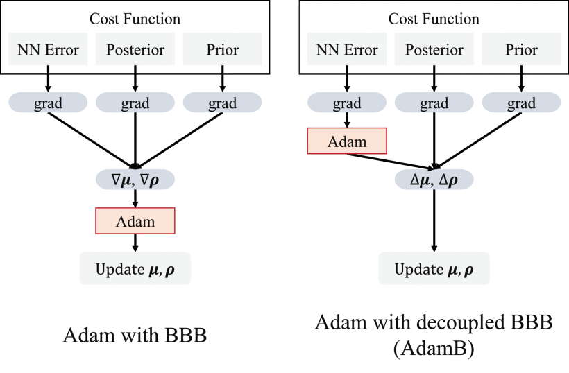

# AdamB: Adam with Decoupled Bayes by Backprop
[](https://opensource.org/licenses/MIT)

This is sample codes in [AdamB: Decoupled Bayes by Backprop With Gaussian Scale Mixture Prior](https://ieeexplore.ieee.org/document/9874837) paper.

<p align="center">

</p>

## Requirements
This code has been tested on pytorch 1.9.0 with python 3.8.7

## Example code execution
To train ResNet-18 by AdamB
```bash
$ cd examples
$ python train_adamb.py
```
ECE evaluation after train.
```bash
$ python inference_adamb.py
```

## Note
Normalization layer runs Adam (not AdamB) without regularization.

## Citation
If used in research, please cite [AdamB](https://ieeexplore.ieee.org/document/9874837)  by the following publications:
```
@ARTICLE{nishida2022adamb,
  author={Nishida, Keigo and Taiji, Makoto},
  journal={IEEE Access}, 
  title={AdamB: Decoupled Bayes by Backprop With Gaussian Scale Mixture Prior}, 
  year={2022},
  volume={10},
  number={},
  pages={92959-92970},
  doi={10.1109/ACCESS.2022.3203484}}
```

## Acknowledgements
This library is based on results obtained from a project commissioned by the New Energy and Industrial Technology Development Organization (NEDO) under Project JPNP16007. 